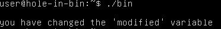
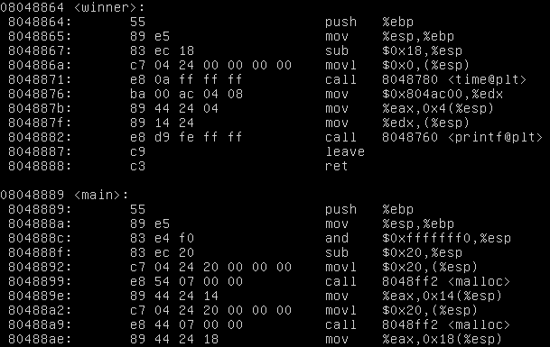
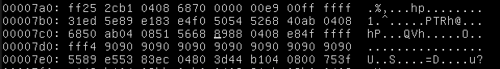

# hole-in-bin

## General

The task is to complete various exercices in the provided virtual machine and involves exploiting and reverse engineering binaries.

## Setup

 Download VirtualBox or any other VM software
 
 Dowload the virtual machine

 Login with uname: user pass: user

 User must copy the binaries to the `user` folder to be able to edit them.

## Tools

 cp - copy a file.

 objdump - display information from object files
 
 less - displays the contents of a file or a command output one page at a time.

 vim - a text editor for use on the terminal.

 xxd - make a hexdump or do the reverse. 

## ex00

### This level is completed when you see he "you have changed the 'modified' variable" message.

1. Use `objdump -g bin | less` to analyze the binary and find `volatile modified` with value `0x5c`.
 
 

2. Disassemble with `objdump -d bin | less`.
3. Find integer `0x5c` at `80483fd`. change

 

4. Open in vim and make readable: `vim bin` then `:%!xxd`
5. Edit `5c` at line `0000400` to `00`.

 

6. Convert and save `:%!xxd -r` then `:x!`.
7. `./bin`

 

# ex01

### This level is completed when you see the "you have correctly got the variable to the right value" message.

1. Run bin, then run it with an argument get `0x00000000`

 

2. Disassemble with `objdump -d bin | less`
3. Find argument comparison in main.
4. `cmp 0x62616364, %eax` at `80484ab`

 

4. Open in vim and make readable: `vim bin` then `:%!xxd`
5. Edit value `6463 6261` at `00004a0`  to "`0000 0000`.

 

6. Convert and save `:%!xxd -r` then `:x!`
7. `./bin`

 

## ex02

### This level is completed when you see the "you have correctly modified the variable" message.
1. Run bin, then run it with `GREENIE=x ./bin` get `0x00000000`

 

2. Disassemble with `objdump -d bin | less`
3. Find argument comparison in main.
4. `cmp 0xd0a0d0a, %eax` at `80484ab`

 

4. Open in vim and make readable: `vim bin` then `:%!xxd`
5. Edit value `3d` at `00004e0`  to "`00`.

 

6. Convert and save `:%!xxd -r` then `:x!`
7. `./bin`

 

## ex03

### This level is completed when you see the "code flow successfully changed" message.

1. Disassemble: `objdump -d bin | less`.
2. Find `win` function.
3. Note `win` address: `2484 0408`.
4. Note `main` address: `3884 0408`.

 

5. Change entry point to `win`.
6. Open in vim and make readable: `vim bin` then `:%!xxd`
7. Edit value `3884 0408` at `0000380`  to "`2484 0408`.

 

8. Convert and save `:%!xxd -r` then `:x!`
9. `./bin`

 

## ex04

### This level is completed when you see the "code flow successfully changed" message.

1. Disassemble: `objdump -d bin | less`.
2. Find `win` function.
3. Note `win` address: `f483 0408`.
4. Note `main` address: `0884 0408`.

 

5. Change entry point to `win`.
6. Open in vim and make readable: `vim bin` then `:%!xxd`
7. Edit value `0884 0408` at `0000350`  to "`f483 0408`.

 

8. Convert and save `:%!xxd -r` then `:x!`
9. `./bin`

 

## ex05

### This level is completed when you see the "you have hit the target correctly" message.

1. Disassemble: `objdump -d bin | less`.
2. Identify `vuln` function.
3. Find `jne` in `vuln`.

 

4. Replace `jne` with `je`.
5. Open in vim and make readable: `vim bin` then `:%!xxd`
6. Edit value `75` at `0000410`  to "`74`.

 

7. Convert and save `:%!xxd -r` then `:x!`
8. `./bin`

 

## ex06

### This level is completed when you see the "that wasn't too bad now, was it?" message.

1. Disassemble: `objdump -d bin | less`.
2. Find `winner` function.
3. Note `winner` address: `6488 0408`.
4. Note `main` address: `8988 0408`.

 

5. Change entry point to `winner`.
6. Open in vim and make readable: `vim bin` then `:%!xxd`
7. Edit value `8988 0408` at `0000350`  to "`6488 0408`.

 

8. Convert and save `:%!xxd -r` then `:x!`
9. `./bin`

 

## ex07

### This level is completed when you see the "you have modified the target" message.

1. Disassemble: `objdump -d bin | less`.
2. Identify `vuln` function.
3. Find `jne` in `vuln`.

 

4. Replace `jne` with `je`.
5. Open in vim and make readable: `vim bin` then `:%!xxd`
6. Edit value `75` at `0000490`  to "`74`.

 

7. Convert and save `:%!xxd -r` then `:x!`
8. `./bin`

 

## ex08

### This level is completed when you see the "you have modified the target" message.

1. Disassemble: `objdump -d bin | less`.
2. Identify `vuln` function.
3. Find `jne` in `vuln`.

 

4. Replace `jne` with `je`.
5. Open in vim and make readable: `vim bin` then `:%!xxd`
6. Edit value `75` at `00004a0`  to "`74`.

 

7. Convert and save `:%!xxd -r` then `:x!`
8. `./bin`

 

## ex09

### This level is completed when you see the "code execution redirected" message.

1. Disassemble: `objdump -d bin | less`.
2. Find `hello` function.
3. Note `hello` address: `b484 0408`.

 

4. Note `main` address: `1485 0408`.

 

5. Change entry point to `hello`.
6. Open in vim and make readable: `vim bin` then `:%!xxd`
7. Edit value `1485 0408` at `0000410`  to "`b484 0408`.

 

8. Convert and save `:%!xxd -r` then `:x!`
9. `./bin`

 

## ex10

### This level is completed when you see the "level passed" message.

1. Disassemble: `objdump -d bin | less`.
2. Find `winner` function.
3. Note `main` address: `8c84 0408`.
4. Note `winner` address: `6484 0408`.

 

5. Change entry point to `winner`.
6. Open in vim and make readable: `vim bin` then `:%!xxd`
7. Edit value `8c84 0408` at `00003c0`  to "`6484 0408`.

 

8. Convert and save `:%!xxd -r` then `:x!`
9. `./bin`

 

## ex11

### This level is completed when you see the "and we have a winner" message.

1. Disassemble: `objdump -d bin | less`.
2. Find `winner` function.
3. Note `main` address: `b984 0408`.
4. Note `winner` address: `9484 0408`.

 

5. Change entry point to `winner`.
6. Open in vim and make readable: `vim bin` then `:%!xxd`
7. Edit value `b984 0408` at `00003f0`  to "`9484 0408`.

 

8. Convert and save `:%!xxd -r` then `:x!`
9. `./bin`

 